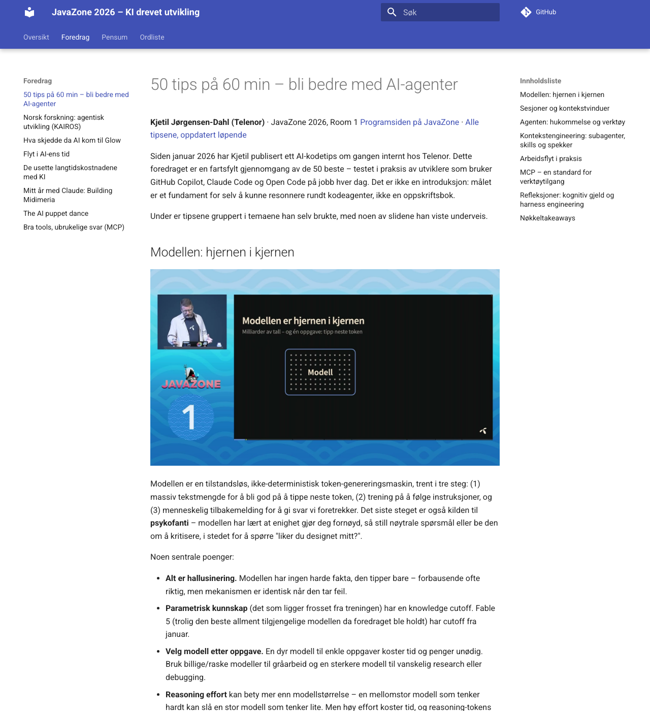

# conference-notes

Two Claude Code / Copilot CLI agent skills that turn raw conference material —
personal notes, an AI-generated draft, session photos, and a talk recording
(YouTube, Vimeo, or any other [yt-dlp](https://github.com/yt-dlp/yt-dlp)-supported
source) — into a write-up: quote-grounded screenshots and links back to the
exact timestamp in the source recording, either as

- a **single markdown page** for one talk (`talk-writeup`), or
- a full **[MkDocs Material](https://squidfunk.github.io/mkdocs-material/)
  site on GitHub Pages**, one enriched page per talk (`conference-notes`,
  which calls into `talk-writeup` once per talk).

📖 **Full docs, security considerations, and use cases:**
https://hkvalheim.github.io/conference-notes/


*A real talk page from [javazone-2026](https://hkvalheim.github.io/javazone-2026/), a site generated with this skill — note the "▶ Se dette i opptaket" link right under the screenshot, linking back to that exact second in the recording. One of the [use cases](https://hkvalheim.github.io/conference-notes/use-cases/standalone-site/) on the docs site.*

## What it does

- Fetches a talk's transcript (native captions when available, local
  Whisper transcription when not) and parses it into clean, timestamped text.
- Extracts screenshots from the moments a quote or claim in the write-up
  already supports — never a blind, evenly-spaced sample.
- Combines notes, AI drafts, photos, and transcript into one markdown page
  per talk, with every quote and image linked back to its source timestamp
  (`talk-writeup`, usable standalone for a single talk).
- Scaffolds and deploys an MkDocs Material site on GitHub Pages, or — via its
  documented fork pattern — adapts into an existing site instead
  (`conference-notes`, for multiple talks; calls `talk-writeup` per talk).

## Install

Pick one:

```bash
# GitHub CLI (native agent-skills support) - both skills
gh skill install hkvalheim/conference-notes conference-notes
gh skill install hkvalheim/conference-notes talk-writeup

# npx skills
npx skills add hkvalheim/conference-notes

# Manual clone + install script (installs both skills)
git clone https://github.com/hkvalheim/conference-notes.git
cd conference-notes
./install.sh claude-code            # or: claude-code-project, copilot, copilot-agents, copilot-project, custom <dest>
```

Re-run `./install.sh <target>` after `git pull` to resync an installed copy
with this repo.

## Repository layout

```
skills/conference-notes/   # full multi-talk site skill (SKILL.md) - calls talk-writeup per talk
skills/talk-writeup/       # single-talk write-up skill (SKILL.md + scripts/) - the shared mechanics live here
docs/                       # this repo's own documentation site source
mkdocs.yml
install.sh
```

See the [docs site](https://hkvalheim.github.io/conference-notes/) for the CLI
tools this skill relies on, security considerations before running it, and
worked examples (a standalone conference site, and a project-local fork that
writes into an existing site).

## License

MIT — see [LICENSE](LICENSE).
