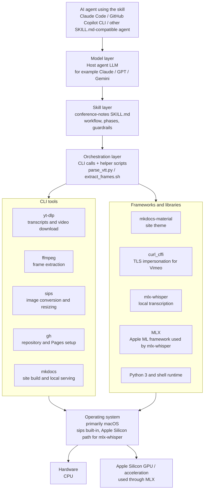

# How it works

The skill is a set of instructions for an AI coding agent, not a standalone
program — it works by telling the agent exactly which CLI tools to shell out
to, in what order, and what to watch out for. Here's what each tool is for.

## Stack overview

This layered view shows the stack from the underlying hardware up to the AI
agent using the skill. The model belongs to the host agent, not to the skill
itself — the skill contributes the workflow, tool choices, and guardrails.

## [`yt-dlp`](https://github.com/yt-dlp/yt-dlp)

Fetches transcripts and, when screenshots are wanted, the video itself.
Used instead of `WebFetch` or a browser-automation tool because YouTube's
page HTML doesn't contain the transcript (`WebFetch` only sees the footer)
and a headless browser gets stuck on the cookie dialog. `yt-dlp` talks to
YouTube's internal API directly and works for transcripts alone with
`--skip-download` — no video needs to be downloaded unless screenshots are
also wanted.

`yt-dlp` supports 1800+ sites beyond YouTube; the same approach generally
works for any of them that ship native captions.

## [`ffmpeg`](https://ffmpeg.org/)

Extracts still frames from a downloaded video at specific timestamps, and is
used for a quick multi-frame "probe" pass first to check whether a talk has
any slides or screen-share worth capturing at all — some recordings are
pure talking-head footage, and forcing a screenshot there adds no
information a reader doesn't already get from the speaker's photo.

## [`sips`](https://ss64.com/mac/sips.html)

macOS's built-in image tool. Used twice: once to shrink HEIC originals into
small JPEGs the agent can actually read (the Read tool rejects files over
256KB), and again to produce the larger, higher-quality JPEGs that ship in
the published site.

## [`curl_cffi`](https://github.com/lexiforest/curl_cffi) (Vimeo only)

Vimeo's player endpoint sits behind a Cloudflare Turnstile challenge that
blocks plain HTTP clients — including plain `yt-dlp` — with a `401`
regardless of headers, because it's TLS-fingerprint based bot detection, not
a missing header. `yt-dlp --impersonate chrome` (via `curl_cffi`) makes the
request look like a real Chrome TLS handshake, which passes the challenge
without needing cookies or a manual browser step.

## [`mkdocs`](https://www.mkdocs.org/) + [`mkdocs-material`](https://squidfunk.github.io/mkdocs-material/)

Builds and serves the published site itself — the actual output of the
whole skill.

## [`gh`](https://cli.github.com/)

GitHub's CLI. Creates the repository, pushes it, and — critically — fixes a
GitHub Pages default that would otherwise serve `README.md` instead of the
built site (see the skill's own Phase 5 for the exact `gh api` call this
requires).

## [`mlx-whisper`](https://github.com/ml-explore/mlx-examples/tree/main/whisper) (Vimeo only, Apple Silicon)

Vimeo recordings typically ship no captions at all, unlike YouTube's
auto-subs — so the skill transcribes locally. `mlx-whisper` uses the GPU via
Apple's MLX framework and is much faster than CPU-only Whisper. This is an
Apple Silicon-specific choice, not a general one — the skill doesn't
currently document a non-Apple-Silicon transcription path.

For Norwegian specifically, the skill's Phase 0b now documents converting
[NB-Whisper](https://huggingface.co/NbAiLab/nb-whisper-large) — the National
Library of Norway's own fine-tune, trained on 66,000 hours of NRK, Storting,
and National Library speech — to MLX once per machine, and pointing
`mlx-whisper` at that local conversion instead of the default model. Same
inference speed as `large-v3` on the same hardware once converted; the
accuracy gain is free from then on. Worth knowing if you're adapting this
skill for another lower-resource language: check whether a domain-specific
fine-tune exists on Hugging Face before assuming the general-purpose model is
good enough, and verify with a real transcript rather than trusting published
benchmark numbers alone — a distilled/turbo variant of NB-Whisper looked
attractive on paper but turned out to drop entire sentences in testing, a gap
the benchmarks (measured on the full model) didn't surface.

